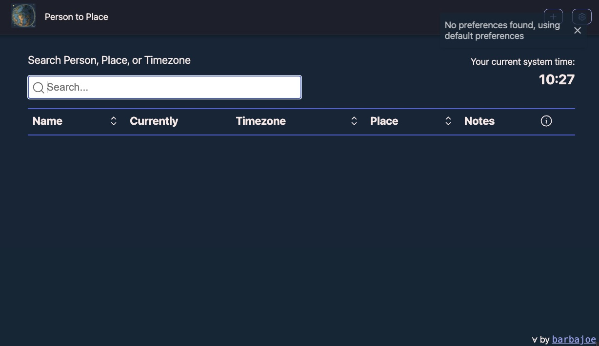
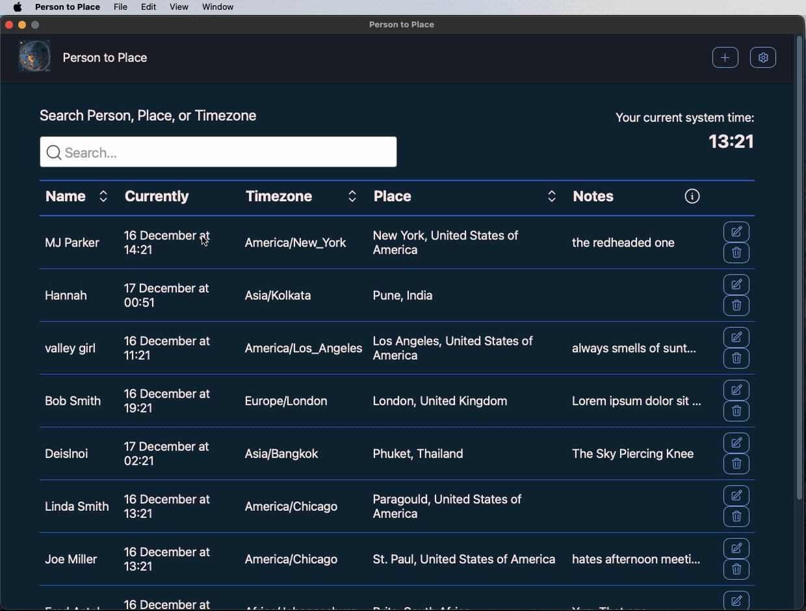
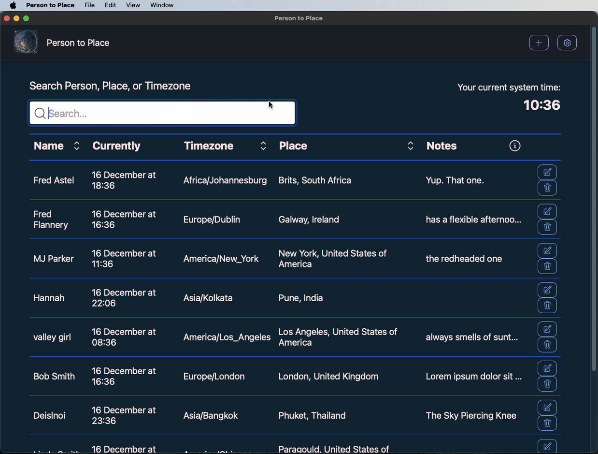

# Person to Place

Are you sick to death of trying to remember who lives where and what time it is there? Me too.

## features and functionality examples

The app is fully local. When you first load it up you will be see the following message, "No preferences found, using default preferences" which just means that everything is turned on.

Tha app has full CRUD functionality.

The app allows searching for a person, place, or timezone independant of if those options are shown.

Finally, the app has a wide range of preferences to choose from, such as what columns to show, date and time format, and more.

## dev notes

- all icons created from my Calvin face image via: `pnpm tauri icon ./src-tauri/icons/app-icon.png`
  - [docs here](https://tauri.app/v1/guides/features/icons/#command-usage)
- run app dev: `pnpm tauri dev`
- run web dev: `pnpm dev`
- generate a new set of app icons: `pnpm tauri icon ./src-tauri/icons/app-icon.png`
  - works with (almost) any type of image format
- generate the app
  - note that this is taken care of via [Tauri's GitHub Actions](https://github.com/tauri-apps/tauri-action).
  - [generate mac app](https://tauri.app/v1/guides/building/macos/)
    - apple silicon: `pnpm tauri build --target aarch64-apple-darwin`
    - intel: `pnpm tauri build --target x86_64-apple-darwin`
    - universal: `tauri build --target universal-apple-darwin`
  - [generate pc app](https://tauri.app/v1/guides/building/windows): `pnpm tauri build --target x86_64-pc-windows-msvc`

## other notes

_After_ starting work on this project, I found [Clocker](https://github.com/n0shake/clocker) for Mac. Clocker solves a similar problem, and is free, but is Mac only and doesn't have a "notes" feature or as much customization. If what you need is a simple name-to-time on a Mac, Clocker may be a better product for you. If you need slightly more extensive notes, a larger display, and want more customization options, Person to Place may be a better product for you.

The app images were generated by "[Stable Doodle](https://clipdrop.co/stable-doodle)"

Data for the app is stored at:

- Mac: `/Users/[username]/Library/Application Support/com.tauri.dev/.settings.dat`
- PC: unknown
